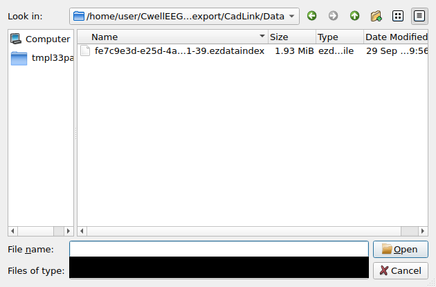
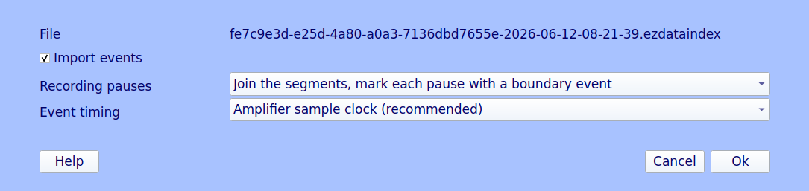
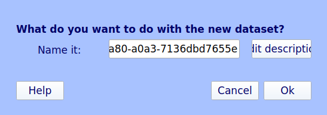
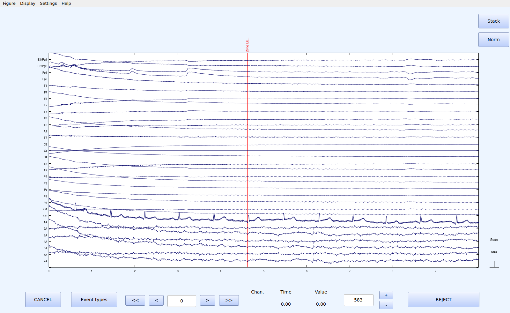

# EEGLAB plugin screenshots (TST018)

The `cadwellio` plugin in EEGLAB's own graphical interface, under GNU Octave
8.4 on a virtual display. The recording is public test export 3 (a
volunteer, no patient data). The screenshots were written by

```bash
.venv/bin/python tools/eeglab_screenshots.py      # -> docs/screenshots/eeglab/*.png
```

which starts EEGLAB with the plugin installed as from its zip. It chooses
*File > Import data > Using EEGLAB functions and plugins > From Cadwell*
and then works the real dialogs from outside, as a user would (xdotool):

- it types the export's `CadLink/Data` folder and then the `.ezdataindex`
  name into the file dialog;
- it presses *Ok* in the options dialog and in EEGLAB's naming dialog,
  keeping the defaults;
- it shows the dataset with `pop_eegplot` in a 10 s window.

`tests/test_eeglab_screenshots.py` runs the same tool in the test suite,
and in CI, which keeps the images as the artifact `eeglab-screenshots`. It
checks only that the four images exist, have the expected size and are
not blank. Whether they show the right thing is checked by hand, using the
checklist below.

## 1. File dialog



## 2. Import options dialog



## 3. EEGLAB's dataset naming dialog



## 4. The EEG, first page, 10 s



## Manual verification checklist

Pass if every item holds. Reference values come from the recording itself
(`pop_cadwell` on export 3) and from the vendor's EDF export
(`testdata/public/cadwell-export3/export-edf/cadwell3.edf`).

1. **File dialog**
   - It shows the `CadLink/Data` folder of export 3.
   - That folder lists the one `.ezdataindex` file.
2. **Options dialog**
   - The file name shown is that `.ezdataindex`.
   - *Import events* is ticked.
   - *Recording pauses* reads *Join the segments, mark each pause with a
     boundary event*.
   - *Event timing* reads *Amplifier sample clock (recommended)*.
   - It has *Help*, *Cancel* and *Ok* buttons.
   - All text can be read.
3. **Naming dialog**
   - It is EEGLAB's *What do you want to do with the new dataset?*.
   - The name field is filled in with the recording GUID
     (`fe7c9e3d-…-7136dbd7655e`).
4. **EEG**
   - *Channels:* 32 channel labels, top to bottom E1/Pg1, E2/Pg2, Fp1, Fp2,
     T1, F7, F3, Fz, F4, F8, T2, A1, T7, C3, Cz, C4, T8, A2, P7, P3, Pz, P4,
     P8, O1, O2, 1A … 7A. This is the order of the vendor EDF (`EEG Fp1-Cz`
     …, `EEG 1A-1R` …).
   - *Time axis:* 0 to 10 s, and the page field reads 0.
   - *Cz:* its trace is a flat line. Cz is the recording reference, so it
     is zero.
   - *Event:* one event marker, *Øyne lukket* ("eyes closed"), at 4.6 s
     (4.618 s by the recording's tick clock).
   - *Signals:* plausible EEG, with slow electrode drift at the start and
     no import artefacts such as steps, clipping, blocks of zeros or
     repeated segments. There is no filter: EEGLAB shows the raw
     referential data.

## Known cosmetic issues under Octave (not the plugin's)

- The file dialog is Qt's own. On the virtual display, without a window
  manager or theme, its *Files of type* box is drawn black.
- EEGLAB's naming dialog is laid out too narrow under Octave. The name field
  is scrolled to its end, and *Edit description* is cut off.

## Verification record

| Date | Screenshots from | Verified by | Result | Notes |
|---|---|---|---|---|
| 2026-09-29 | this commit (Octave 8.4, EEGLAB Sept 2026) | Claude Code session (pre-check, not the manual verification) | all items hold | cosmetic issues above |
| | | *(human reviewer)* | | |
